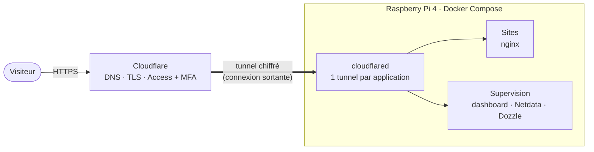

<h1 align="center">Maxime Labatut</h1>
<p align="center"><strong>Mon homelab auto-hébergé sur un Raspberry Pi 4</strong><br>
Des sites et des outils qui tournent à la maison, publiés sans ouvrir un seul port.</p>

<p align="center">
  
  
  
  
  
  
  
  
  
  
  
</p>

---

## En bref

Ce dépôt contient **toute la configuration de mon serveur personnel** : les conteneurs, les sites, le dashboard de supervision et les scripts de restauration. Il sert aussi de page de profil.

- **Un conteneur par application**, chacun avec son propre **tunnel Cloudflare** : aucun port n'est ouvert sur ma box.
- **Une page d'accueil** avec le statut en direct des services.
- **Un dashboard sur mesure** : température du CPU, charge, mémoire, stockage, un tiroir par application (conteneur + tunnel), et accès aux logs en un clic.
- **Des alertes sur téléphone** (Uptime Kuma + ntfy) quand un site ne répond plus.
- **Des outils d'administration protégés** par Cloudflare Access + authentification à deux facteurs.
- **Une restauration en une commande** si la carte SD lâche.
- **Les fichiers de tous les services** modifiables depuis le Mac via Samba.

## En ligne

| Adresse | Description | Accès |
|---|---|---|
| [www.maximelabatut.com](https://www.maximelabatut.com) | Page d'accueil du homelab, avec statut en direct | Public |
| [gamevault.maximelabatut.com](https://gamevault.maximelabatut.com) | GameVault | Public |
| [web2.maximelabatut.com](https://web2.maximelabatut.com) | Web2, terrain d'expériences | Public |
| `config.maximelabatut.com` | Dashboard de supervision | Cloudflare Access + MFA |
| `netdata.maximelabatut.com` | Métriques détaillées (Netdata) | Cloudflare Access + MFA |
| `logs.maximelabatut.com` | Logs des conteneurs (Dozzle) | Cloudflare Access + MFA |
| `uptime.maximelabatut.com` | Surveillance et alertes (Uptime Kuma) | Cloudflare Access + MFA |

## Architecture



Le Pi ouvre lui-même la connexion vers Cloudflare. Rien n'est exposé directement sur Internet, et les outils d'administration ne sont atteignables qu'après authentification.

## La stack

| Couche | Technologies |
|---|---|
| Matériel | [Raspberry Pi 4](https://www.raspberrypi.com/) (4 Go), boîtier [Argon ONE V2](https://argon40.com/) (ventilateur régulé) |
| Système | Raspberry Pi OS Lite 64 bits |
| Conteneurs | [Docker Compose](https://docs.docker.com/compose/), 16 conteneurs |
| Serveur web | [nginx](https://nginx.org/) |
| Réseau et sécurité | [Cloudflare Tunnel](https://developers.cloudflare.com/cloudflare-one/connections/connect-networks/), [Cloudflare Access](https://developers.cloudflare.com/cloudflare-one/access-controls/) avec MFA |
| Supervision | [Netdata](https://www.netdata.cloud/) (métriques), [Dozzle](https://dozzle.dev/) (logs), [Uptime Kuma](https://github.com/louislam/uptime-kuma) (surveillance) avec alertes [ntfy](https://ntfy.sh/) sur téléphone, dashboard en HTML/JavaScript sans dépendance |
| Fichiers | [Samba](https://www.samba.org/) |
| Automatisation | scripts shell (restauration, statut public, liste des conteneurs) |

## Structure du dépôt

```
.
├── docker-compose.yml      # les 16 conteneurs (sites, tunnels, supervision)
├── .env.example            # variables attendues (le vrai .env n'est jamais versionné)
├── www/                    # page d'accueil + www-status (statut public en direct)
├── gamevault/  web2/       # applications (nginx)
├── dashboard/              # dashboard sur mesure (nginx + liste des conteneurs)
├── netdata/                # configuration de Netdata
├── argon/                  # courbe du ventilateur du boîtier Argon ONE
├── restore.sh              # restauration complète, exécutée sur le Pi
├── mac/restaurer-pi.sh     # lance la restauration depuis le Mac
└── docs/                   # documentation détaillée
```

## Démarrage

```bash
git clone https://github.com/maximelabatut/maximelabatut.git ~/docker
cd ~/docker
cp .env.example .env        # puis renseigner les tokens des tunnels
docker compose up -d
```

### Variables d'environnement

| Variable | Rôle |
|---|---|
| `CLOUDFLARE_TUNNEL_TOKEN_WWW`, `_GAMEVAULT`, `_WEB2`, `_CONFIG`, `_LOGS`, `_NETDATA`, `_UPTIME` | Un token par tunnel Cloudflare, un tunnel par application |
| `DOCKER_GID` | Identifiant du groupe `docker` de la machine, lu par Netdata (`getent group docker \| cut -d: -f3`) |

## Sécurité

- Les secrets (tokens des tunnels) restent dans un `.env` **hors de git**.
- Aucun port ouvert sur la box : les tunnels sont des connexions sortantes.
- Les outils de supervision sont derrière **Cloudflare Access + MFA**, et Dozzle n'écoute que sur `127.0.0.1`.
- Le statut public (`www/html/data/status.json`) ne contient que « en ligne / hors ligne » et l'uptime.

## Restauration

Si la carte SD est à remplacer : flasher Raspberry Pi OS Lite 64 bits avec Raspberry Pi Imager, puis lancer depuis le Mac une seule commande qui réinstalle tout (système, Docker, configuration, Samba, ventilateur, conteneurs) :

```bash
~/Desktop/raspberrypi/restaurer-pi.sh
```

Détails et procédure manuelle : [`docs/restauration-carte-sd.md`](docs/restauration-carte-sd.md).

## Documentation

| Document | Contenu |
|---|---|
| [`docs/ajouter-un-site.md`](docs/ajouter-un-site.md) | Ajouter une application de bout en bout (conteneur, tunnel, DNS, Access), monitoring, dépannage |
| [`docs/restauration-carte-sd.md`](docs/restauration-carte-sd.md) | Restauration complète après changement de carte SD |

---

<p align="center"><sub>Fait main, hébergé à la maison · <a href="https://github.com/maximelabatut">@maximelabatut</a></sub></p>
