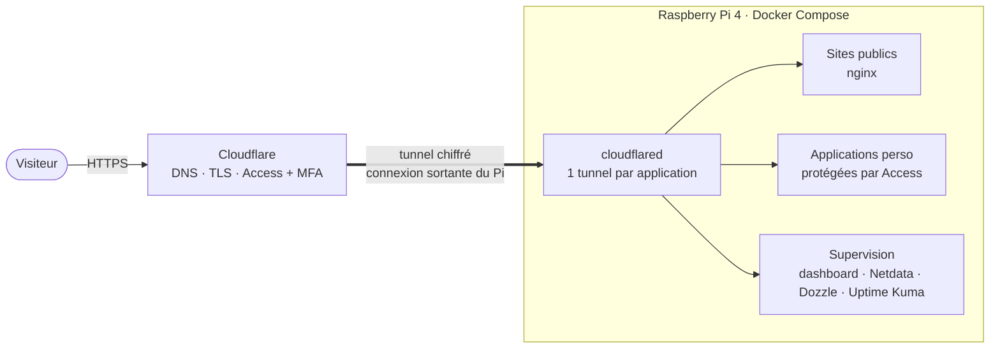
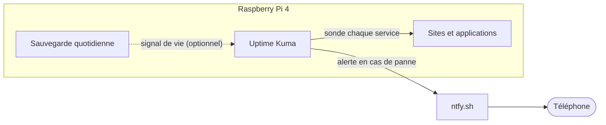
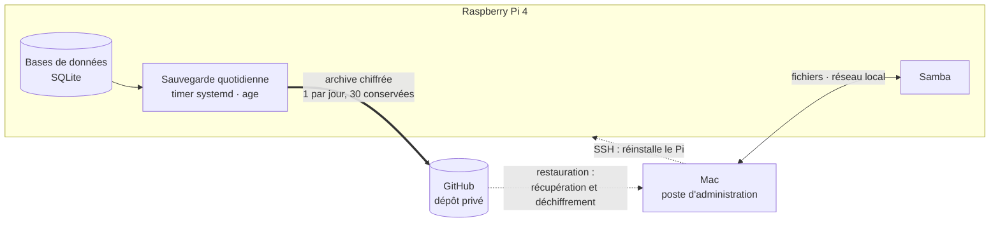

<h1 align="center">Maxime Labatut</h1>
<p align="center"><strong>Mon homelab auto-hébergé sur un Raspberry Pi 4</strong><br>
Des sites et des outils qui tournent à la maison, publiés sans ouvrir un seul port.</p>

<p align="center">
  
  
  
  
  
  
  
  
  
  
  
</p>

---

## En bref

Ce dépôt contient **toute la configuration de mon serveur personnel** : les conteneurs, les sites, le dashboard de supervision et les scripts de restauration. Il sert aussi de page de profil.

- **Un conteneur par application**, chacun avec son propre **tunnel Cloudflare** : aucun port n'est ouvert sur ma box.
- **Une page d'accueil** avec le statut en direct des services.
- **Un dashboard sur mesure** : température du CPU, charge, mémoire, stockage, un tiroir par application (conteneur + tunnel), et accès aux logs en un clic.
- **Des alertes sur téléphone** (Uptime Kuma + ntfy) quand un site ne répond plus.
- **Des outils d'administration protégés** par Cloudflare Access + authentification à deux facteurs.
- **Une restauration en une commande** si la carte SD lâche.
- **Les fichiers de tous les services** modifiables depuis le Mac via Samba.

## En ligne

| Adresse | Description | Accès |
|---|---|---|
| [www.maximelabatut.com](https://www.maximelabatut.com) | Page d'accueil du homelab, avec statut en direct | Public |
| `gamevault.maximelabatut.com` | GameVault (application perso, Python + SQLite) | Cloudflare Access + MFA |
| [web2.maximelabatut.com](https://web2.maximelabatut.com) | Web2, terrain d'expériences | Public |
| `config.maximelabatut.com` | Dashboard de supervision | Cloudflare Access + MFA |
| `netdata.maximelabatut.com` | Métriques détaillées (Netdata) | Cloudflare Access + MFA |
| `logs.maximelabatut.com` | Logs des conteneurs (Dozzle) | Cloudflare Access + MFA |
| `uptime.maximelabatut.com` | Surveillance et alertes (Uptime Kuma) | Cloudflare Access + MFA |

## Architecture

### Accès : du visiteur au conteneur



### Alertes : être prévenu d'une panne



### Sauvegarde et restauration



Traits pleins : flux de service. Pointillés : signaux optionnels et restauration.

### Les flux

| Flux | Chemin | Ce qu'il faut retenir |
|---|---|---|
| **Visite d'un site** | Visiteur → Cloudflare → tunnel → conteneur | Le Pi **ouvre lui-même** la connexion vers Cloudflare : aucun port n'est ouvert sur la box. Chaque application a son propre tunnel, donc son propre token et sa propre panne possible. |
| **Applications et outils d'administration** | Visiteur → Cloudflare Access (+ MFA) → tunnel → conteneur | L'authentification est faite **avant** que la requête n'atteigne le Pi. Seules les pages d'accueil publiques sont ouvertes. |
| **Supervision et alertes** | Uptime Kuma surveille les services ; en cas de panne il notifie via ntfy, qui prévient le téléphone | La surveillance tourne **sur le Pi** : elle ne voit pas une panne du Pi lui-même. La sauvegarde peut envoyer un signal de vie quotidien (moniteur de type « Push ») : son absence déclenche alors l'alerte. |
| **Sauvegarde** | Timer systemd → instantané cohérent des bases → archive chiffrée → dépôt GitHub privé | Une archive par jour, 30 conservées. Le Pi ne détient que la clé *publique* de chiffrement : il ne peut pas relire ses propres sauvegardes. |
| **Restauration** | Mac : récupération de l'archive, déchiffrement, réinstallation du Pi par SSH | Une carte SD vierge devient un homelab complet en une commande. Un test à blanc sans Pi vérifie régulièrement que c'est possible. |
| **Fichiers** | Mac ⇄ Samba (réseau local uniquement) | Le dossier du dépôt est modifiable depuis le Mac comme un disque réseau. |

### Frontières de confiance

- **Internet → Pi** : un seul chemin, les tunnels Cloudflare ; aucun port n'est redirigé sur la box.
- **Réseau local** : les sites publics, le dashboard et les métriques sont aussi joignables depuis le réseau de la maison. Les services les plus sensibles (logs, surveillance, applications personnelles) n'écoutent que sur la boucle locale de la machine : seul `cloudflared` les joint.
- **Public / protégé** : deux sites sont publics ; tout le reste est derrière Cloudflare Access avec second facteur.
- **Secrets** : tokens et mots de passe vivent dans un `.env` et des fichiers hors de git ; ils ne quittent le Pi que **chiffrés** (sauvegarde).
- **Administration** : SSH par clé uniquement, depuis le réseau local ; un contrôle automatique vérifie chaque jour que rien n'est exposé sans Access.
- **Durcissement des conteneurs** : utilisateur non root, système de fichiers en lecture seule et capacités retirées, là où c'est utile.

## La stack

| Couche | Technologie | Rôle |
|---|---|---|
| Matériel | [Raspberry Pi 4](https://www.raspberrypi.com/) Model B (4 Go), boîtier [Argon ONE V2](https://argon40.com/) | Serveur, ventilateur régulé par la température |
| Système | Raspberry Pi OS Lite 64 bits (base Debian), `systemd` | Système minimal sans interface graphique ; timers pour la sauvegarde |
| Conteneurs | [Docker Engine et Compose v2](https://docs.docker.com/compose/), 18 conteneurs (dont 2 à la demande) | Un conteneur par application, un fichier de déploiement |
| Web | [nginx](https://nginx.org/) (image officielle), Python 3.12 (`python:3.12-slim`) | Sites statiques ; applications Python |
| Tunnel et accès | [cloudflared](https://developers.cloudflare.com/cloudflare-one/connections/connect-networks/) (image officielle), [Cloudflare Access](https://developers.cloudflare.com/cloudflare-one/access-controls/) avec MFA | Publication sans port ouvert, authentification en amont |
| Supervision | [Netdata](https://www.netdata.cloud/) (branche stable), [Dozzle](https://dozzle.dev/) (à la demande), [Uptime Kuma](https://github.com/louislam/uptime-kuma) 2 (SQLite) | Métriques, logs, surveillance |
| Alertes | [ntfy](https://ntfy.sh/) | Notifications sur téléphone |
| Dashboard | HTML / JavaScript sans dépendance, servi par nginx | Vue d'ensemble : un tiroir par application, consommation CPU, accès aux logs |
| Fichiers | [Samba](https://www.samba.org/) | Partage du dossier du dépôt avec le Mac |
| Données | SQLite (instantanés par `.backup`, cohérents même pendant l'écriture) | Bases d'Uptime Kuma et des applications |
| Sauvegarde | `systemd` timer, [age](https://age-encryption.org/) (chiffrement), `git` vers un dépôt GitHub privé | Archive chiffrée quotidienne, 30 jours |
| Automatisation | scripts `bash` | Restauration, sauvegarde, contrôle d'exposition, statut public, liste des conteneurs |

## Structure du dépôt

```
.
├── docker-compose.yml      # les 18 conteneurs (sites, tunnels, supervision ; Dozzle et son tunnel à la demande)
├── .env.example            # variables attendues (le vrai .env n'est jamais versionné)
├── www/                    # page d'accueil + www-status (statut public en direct)
├── web2/                   # application (nginx)
├── gamevault/              # application Python (code et base hors dépôt ; la base est dans la sauvegarde chiffrée)
├── dashboard/              # dashboard sur mesure (nginx + liste des conteneurs)
├── netdata/                # configuration de Netdata
├── argon/                  # courbe du ventilateur du boîtier Argon ONE
├── restore.sh              # restauration complète, exécutée sur le Pi
├── pi/                     # sauvegarde quotidienne chiffrée (timer systemd) et contrôle d'exposition
├── mac/                    # restauration, lancée depuis le Mac
└── docs/                   # documentation détaillée
```

## Démarrage

```bash
git clone https://github.com/maximelabatut/maximelabatut.git ~/docker
cd ~/docker
cp .env.example .env        # puis renseigner les tokens des tunnels
docker compose up -d
```

### Variables d'environnement

| Variable | Rôle |
|---|---|
| `CLOUDFLARE_TUNNEL_TOKEN_<APPLICATION>` | Un token par tunnel Cloudflare, un tunnel par application (la liste est dans `.env.example`) |
| `DOCKER_GID` | Identifiant du groupe `docker` de la machine, lu par Netdata (`getent group docker \| cut -d: -f3`) |

## Sécurité

- Les secrets (tokens des tunnels) restent dans un `.env` **hors de git**.
- Aucun port ouvert sur la box : les tunnels sont des connexions sortantes.
- Les outils de supervision sont derrière **Cloudflare Access + MFA**, et Dozzle n'écoute que sur `127.0.0.1`.
- Le statut public (`www/html/data/status.json`) ne contient que « en ligne / hors ligne » et l'uptime.
- Les sauvegardes quittent le Pi **chiffrées** (clé publique sur le Pi, clé privée hors du Pi) et un contrôle quotidien vérifie qu'aucun service protégé n'est exposé.

## Restauration

Chaque jour, le Pi envoie lui-même sur un dépôt GitHub privé une archive **chiffrée** (`age`) contenant le `.env` et les données des applications (30 jours conservés) ; la clé de déchiffrement est dans un gestionnaire de mots de passe. Si la carte SD est à remplacer : flasher Raspberry Pi OS Lite 64 bits avec Raspberry Pi Imager, puis lancer depuis le Mac une seule commande qui réinstalle tout (système, Docker, configuration, Samba, ventilateur, données d'Uptime Kuma, conteneurs) :

```bash
git clone https://github.com/maximelabatut/maximelabatut.git ~/homelab-restore
~/homelab-restore/mac/restaurer-pi.sh
```

Détails : [`docs/restauration-carte-sd.md`](docs/restauration-carte-sd.md) (procédure, procédure manuelle, dépannage).

## Documentation

| Document | Contenu |
|---|---|
| [`docs/ajouter-un-site.md`](docs/ajouter-un-site.md) | Ajouter une application de bout en bout (conteneur, tunnel, DNS, Access), monitoring, dépannage |
| [`docs/restauration-carte-sd.md`](docs/restauration-carte-sd.md) | Restauration complète après changement de carte SD |

---

<p align="center"><sub>Fait main, hébergé à la maison · <a href="https://github.com/maximelabatut">@maximelabatut</a></sub></p>
